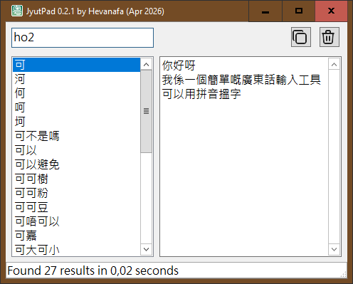
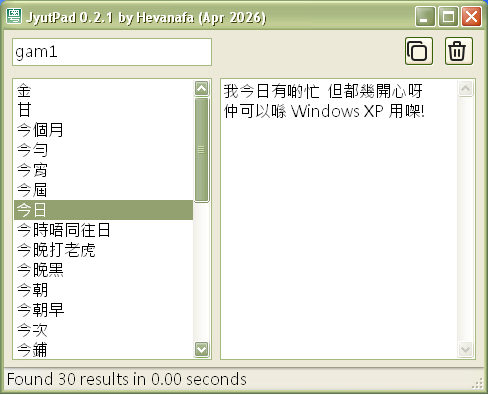

#

## Credits

This project includes the CC-Canto Cantonese dictionary dataset (based on CC-CEDICT)

Source: [cantonese.org](https://cantonese.org/about.html)

License: Creative Commons Attribution-ShareAlike 3.0 (CC BY-SA 3.0)

No changes were made to the original dataset

The icons for the copy & clear buttons are from [Tabler Icons](https://github.com/tabler/tabler-icons), licensed under the MIT License
